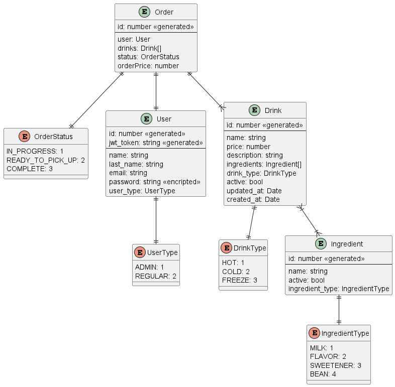

# Requerimientos Proyecto Final

## Aplicación para solicitar bebidas en la cafetería del ITAM

__Desarollada por:__

- [Bruno Vitte San Juan](https://github.com/Tanque40)
- [Axel Dávila López](https://github.com/AxelDavilaLopez)
- [Miguel Leonardo Méndez Mejía](https://github.com/Miguel00000000000)
- [Natalia Gomez Alvarez]()
- [Rafael Alejandro Bautista Baca]()

## Tabla de contenido

- [Requerimientos Proyecto Final](#requerimientos-proyecto-final)
  - [Aplicación para solicitar bebidas en la cafetería del ITAM](#aplicación-para-solicitar-bebidas-en-la-cafetería-del-itam)
  - [Tabla de contenido](#tabla-de-contenido)
  - [Introducción](#introducción)
    - [Proposito](#proposito)
    - [Público objetivo y sugerencias de lectura](#público-objetivo-y-sugerencias-de-lectura)
    - [Definición del producto](#definición-del-producto)
  - [Descripción General](#descripción-general)
    - [Perspectiva del producto](#perspectiva-del-producto)
    - [Funcionalidades del producto](#funcionalidades-del-producto)
    - [Clases de usuario y características](#clases-de-usuario-y-características)
    - [Entorno operativo](#entorno-operativo)
    - [Restricciones de diseño e implementación](#restricciones-de-diseño-e-implementación)
    - [Suposiciones y dependencias](#suposiciones-y-dependencias)
  - [Requisitos de la interfaz externa](#requisitos-de-la-interfaz-externa)
    - [Interfaces de usuario](#interfaces-de-usuario)
    - [Interfaces de hardware](#interfaces-de-hardware)
    - [Interfaces de software](#interfaces-de-software)
    - [Interfaces de comunicaciones](#interfaces-de-comunicaciones)
  - [Características del sistema](#características-del-sistema)
    - [Autenticación de usuario](#autenticación-de-usuario)
    - [Selección de bebidas](#selección-de-bebidas)
    - [Pedido y Pago](#pedido-y-pago)
  - [Otros requisitos no funcionales](#otros-requisitos-no-funcionales)
    - [Reglas de la plataforma](#reglas-de-la-plataforma)
- [Apéndice A: Definición de la arquitectura](#apéndice-a-definición-de-la-arquitectura)
- [Apéndice B: Metodología de trabajo](#apéndice-b-metodología-de-trabajo)
- [Apéndice C: Casos de uso](#apéndice-c-casos-de-uso)

## Introducción

### Proposito

El software descrito en este documento consiste en una aplicación para pedir café de manera personalizada en una cafetería y realizar el pago de manera conveniente. El objetivo principal de esta aplicación es brindar a los clientes la posibilidad de solicitar café a su gusto y realizar el proceso de compra de forma eficiente a través de un menú digital y una personalización de pedidos. Esta aplicación estará disponible para computadoras a través de un navegador de internet.

### Público objetivo y sugerencias de lectura

Este documento se encuentra orientado principalmente a programadores y desarrolladores con un nivel básico de experiencia en lenguajes de programación, tales como Python, HTML, C#, entre otros. Asimismo, se espera que los lectores tengan un conocimiento comprensivo sobre el funcionamiento de bases de datos y servicios web.

### Definición del producto

Esta aplicación de pedidos de café beneficiará a clientes que buscan personalizar su experiencia de compra y asegurarse de que su café sea preparado a su gusto. Los clientes podrán solicitar café a medida, ajustando factores como el tipo de café, el tamaño, la cantidad de azúcar, leche o crema, y otros ingredientes adicionales. Los clientes podrán examinar detalladamente las descripciones de las bebidas y los métodos de preparación antes de realizar sus pedidos.

## Descripción General

### Perspectiva del producto

Este producto nace como respuesta a las necesidades de los amantes del café que desean disfrutar de una plataforma segura y eficiente para realizar pedidos de café personalizados. Los clientes que anhelan explorar y disfrutar de una amplia gama de opciones de café podrán hacerlo a través de esta plataforma. A través de la aplicación podrán anunciar sus creaciones, especificar los ingredientes y los métodos de preparación, así como establecer los precios de sus bebidas de café personalizadas. La plataforma se centra en garantizar a los clientes que las bebidas que soliciten sean atendidas con una atención de calidad y eficiente.

### Funcionalidades del producto

Para los clientes que deseen utilizar esta aplicación, se ofrecerán diversas funcionalidades de las cuales se incluyen:

- Buscar bebidas de café de su interés
- Seleccionar el tipo de café
- Personalizar el café con el tamaño, ingredientes y demás detalles
- Realizar el pedido

A través de la aplicación, los administradores podrán:

- Agregar una bebida
- Eliminar una bebida
- Agregar ingredientes
- Eliminar ingredientes

### Clases de usuario y características

En el contexto de la aplicación de pedidos de café, los clientes podrán explorar y personalizar sus pedidos de café, por lo cual podrán tener acceso a la base de datos de cafés y podrán revisar las bebidas disponibles.

Los administradores de la plataforma podrán revisar y gestionar los tipos de bebidas que se ofrecen, así como los ingredientes que se pueden usar, garantizando la calidad y la integridad de la aplicación.

### Entorno operativo

La plataforma estará disponible y plenamente funcional en una amplia variedad de navegadores web y dispositivos, incluyendo computadoras, teléfonos móviles, tablets y otros, sin imponer ninguna restricción basada en el entorno operativo ya que esta será una página web.

### Restricciones de diseño e implementación

En la etapa inicial del desarrollo del software, el acceso a la aplicación estará limitado exclusivamente a los miembros de la comunidad del ITAM, que incluye alumnos y profesores. Además, la capacidad de carga de datos estará sujeta a las limitaciones establecidas por la plataforma de almacenamiento seleccionada.

### Suposiciones y dependencias

En este documento se asume que todos los usuarios tendrán una cuenta de la cafetería y su contraseña correspondiente para acceder.

## Requisitos de la interfaz externa

### Interfaces de usuario

Requisitos de la interfaz externa para clientes:

- Registro usuario: el usuario debe registrarse en la aplicación con nombre, correo y contraseña.
- Inicio de sesión: los usuarios registrados deben poder iniciar sesión con su cuenta creada
- Página de búsqueda de bebidas: se debe poder buscar las bebidas de café de su interés utilizando un motor de búsqueda o una lista desplegada de las bebidas disponibles, con una imagen de la bebida.
- Página de visualización de detalles y personalización de bebidas: al seleccionar una bebida, se deben mostrar los detalles, como el tipo de café, los ingredientes, el tamaño y el precio.  Además, se debe tener la capacidad de personalizar su bebida, seleccionando el tamaño, agregando o eliminando ingredientes y realizando otras personalizaciones según sea necesario. Finalmente, el usuario deberá poder añadir su bebida seleccionada a un botón de carrito.
- Apartado de carrito: en este apartado el usuario va a poder revisar las bebidas agregadas al carrito y posteriormente confirmar su pedido.

Requisitos de la interfaz externa para administradores:

- Inicio de sesión de administradores: los administradores deben poder iniciar sesión en una interfaz separada con sus credenciales de administrador.
- Página de gestión de bebidas: se debe poder agregar nuevas bebidas al menú, especificando detalles como el nombre de la bebida, tipo de café, ingredientes, precio e imagen. También se podrán agregar nuevos ingredientes a la lista de ingredientes disponibles, modificarlos o eliminarlos. Por otro lado, deben poder eliminar bebidas del menú si es necesario.
- Página de reportes: los administradores podrán tener acceso a reportes que despliegan información de resumen de ventas, ventas por período, usuarios registrados, ingresos por métodos de pago, reporte de errores y problemas, tener gráficos y visualizaciones, etc. Finalmente, poder exportar los reportes.  La página de reportes proporciona a los administradores una visión más completa del rendimiento de la plataforma y les permitiría tomar decisiones informadas para mejorar el negocio. También puede ser útil para la planificación y la toma de decisiones estratégicas.

### Interfaces de hardware

La aplicación está pensada para que se pueda utilizar desde dispositivos como: teléfono celular, tableta, laptop y PC. Los dispositivos no mencionados no son contemplados y no deberá tomarse en cuenta ninguna compatibilidad.

### Interfaces de software

__Capa de presentación__: Es la capa que se encarga de la interfaz de usuario, es decir, de mostrar la información y los elementos gráficos que permiten al usuario interactuar con la aplicación. Esta capa puede estar implementada con tecnologías web como HTML, CSS y JavaScript, o con frameworks nativos para dispositivos móviles como Android o iOS.

__Se decidió finalmente ocupar el framework de desarrollo web, _NextJS_, dada su facilidad para el desarrollo de la pagina y de su modularidad al estar basada en React__

__Capa de negocio__: Es la capa que se encarga de la lógica de negocio, es decir, de las reglas y los procesos que definen el funcionamiento de la aplicación. Esta capa puede estar implementada con lenguajes de programación como Java, C# o Python, y puede utilizar patrones de diseño como MVC o MVP para separar las responsabilidades y facilitar el mantenimiento y la escalabilidad.

> Aquí se puede hacer todo en una capa como está expresado o se puede dividir en dos diferentes, se deja a la elección del desarrollador.

__Se decidió finalmente usar el framework de JavaScript, NestJS, debido a que es más facil de usar con _Typescript_ lo cual nos ayuda a tener tipado fuerte y poder desarrollar de manera más segura__

__Capa de datos__: Es la capa que se encarga de la gestión de los datos, es decir, de almacenar, recuperar y manipular la información que utiliza la aplicación. Esta capa puede estar implementada con sistemas de gestión de bases de datos como MySQL, MongoDB o Firebase, y puede utilizar técnicas como el mapeo objeto-relacional (ORM) o el acceso a datos mediante servicios web (API) para abstraer los detalles técnicos y mejorar el rendimiento y la seguridad.

__Para el manejo de datos ocuparemos el software _Postgresql_ debido a su facilidad de implementar en el entorno de desarrollo basado en linux y las ya implementadas librerías de _TypeORM_ en el framework de _NestJS_, el cual también ya se mencionó en la capa anterior__

El diagrama de la base de datos es el sigueinte:

### Interfaces de comunicaciones

Todos los usuarios deberán proporcionar una cuenta y una contraseña para la generación de su cuenta, a través de la cual podrán hacer la personalización y compra de su café.  No se les pedirá otro dato a los usuarios, a menos que se especifique un cambio posteriormente como un número de celular.

## Características del sistema

### Autenticación de usuario

1. Descripción y Prioridad
   1. Permitir que los y las alumnas se autentiquen en la aplicación. Prioridad: Alta
1. Secuencia de Estímulo/Respuesta
    1. El usuario inicia la aplicación.
    1. El usuario ingresa su nombre de usuario y contraseña.
    1. El sistema valida las credenciales.
    1. El sistema proporciona acceso al usuario o muestra un mensaje de error.
1. Requisitos Funcionales
    1. El sistema debe proporcionar una interfaz para ingresar nombre de usuario y contraseña.
    1. El sistema debe validar las credenciales contra una base de datos.
    1. Si las credenciales son incorrectas, el sistema debe mostrar un mensaje de error.
    1. Si las credenciales son correctas, el sistema debe permitir el acceso a la plataforma principal.

### Selección de bebidas

1. Descripción y Prioridad
    1. Permitir que los usuarios visualicen y seleccionen las bebidas disponibles en la cafetería. Prioridad: Alta
1. Secuencia de Estímulo/Respuesta
    1. El usuario accede al menú de bebidas.
    1. El usuario visualiza la lista de bebidas disponibles.
    1. El usuario selecciona una bebida de su elección.
    1. Requisitos Funcionales
    1. El sistema debe mostrar todas las bebidas disponibles con sus respectivos precios.
    1. El sistema debe proporcionar una opción de selección para cada bebida.
1. Requisitos Funcionales
    1. El sistema debe proporcionar una interfaz para ingresar nombre de usuario y contraseña.
    1. El sistema debe validar las credenciales contra una base de datos.
    1. Si las credenciales son incorrectas, el sistema debe mostrar un mensaje de error.
    1. Si las credenciales son correctas, el sistema debe permitir el acceso a la plataforma principal.

### Pedido y Pago

1. Descripción y Prioridad
    1. Permitir que los usuarios realicen pedidos de bebidas y procedan al pago. Prioridad: Alta
1. Secuencia de Estímulo/Respuesta
    1. El usuario agrega una o más bebidas a su carrito.
    1. El usuario procede al proceso de pago.
    1. El usuario elige su método de pago y confirma el pedido.
    1. El sistema valida el pago y confirma el pedido al usuario.
1. Requisitos Funcionales
    1. El sistema debe proporcionar un carrito de compras donde el usuario pueda revisar su pedido antes de pagar.
    1. El sistema debe proporcionar opciones de métodos de pago (e.g., tarjeta de crédito, pago móvil).
    1. El sistema debe emitir una confirmación una vez que el pedido haya sido exitosamente realizado.

## Otros requisitos no funcionales

### Reglas de la plataforma

1. Únicamente los administradores de la plataforma podrán realizar cambios en las bebidas.
2. Los administradores podrán gestionar los métodos de pago.
3. Los clientes podrán solicitar el pedido de sus bebidas y realizar su pago

# Apéndice A: Definición de la arquitectura

En este proyecto, se adoptó una estrategia de desarrollo de la arquitectura por capas. La elección de la arquitectura por capas se basó en la experiencia y conocimientos del equipo de desarrollo, así como en la limitación de tiempo disponible para llevar a cabo el proyecto. La arquitectura por capas se seleccionó por su simplicidad de implementación y pruebas, ya que no requería la presencia de un desarrollador senior para su uso efectivo.

# Apéndice B: Metodología de trabajo

Empleamos la metodología Feature Driven Development (FDD) en la ejecución del proyecto, permitiendo que múltiples miembros del equipo trabajarán simultáneamente en diversas funcionalidades sin que sus contribuciones interfirieran entre sí. Esta metodología nos brindó la ventaja de optimizar eficazmente el tiempo disponible para la ejecución del proyecto, alineando tareas y recursos de manera eficiente.

# Apéndice C: Casos de uso

__Registro de usuario__: el usuario accede a la página de registro para poder introducir sus datos básicos comenzando por su nombre completo y proporcionando su dirección de correo electrónico. Posteriormente, creará una contraseña segura para garantizar la seguridad de su cuenta, además, tendrá la opción de registrar una tarjeta para realizar pagos electrónicos. Esto implica proporcionar los detalles de la tarjeta, como el número de tarjeta, la fecha de vencimiento y el código de seguridad. Después se hace una validación de los datos ingresados para verificar que cumplan con los requisitos y se envía un correo de confirmación. Finalmente, se crea la cuenta del usuario para que pueda tener acceso a la plataforma.

__Registrar una bebida__: los administradores podrán registrar una bebida nueva asignando tipo, tamaño, ingredientes y precio de dicha bebida. Esta nueva bebida deberá aparecer dentro del catálogo de manera inmediata y en su categoría respectiva, también el administrador decide la flexibilidad en la personalización de bebidas, para ello en el mismo registro debe colocar los ingredientes que admite intercambiar y por cuáles permite ese intercambio

__Búsqueda de la bebida__: un usuario podrá buscar bebidas de manera libre desde una página de inicio donde las bebidas aparecerán ordenadas por categoría de arriba hacia abajo y dentro de cada categoría de izquierda a derecha, de este modo podrá explorar la página y decidir lo que desea.

__Elección y personalización de la bebida__: para elegir la bebida, un usuario deberá poder seleccionar la bebida que desea colocando el cursor encima de la bebida de su elección y haciendo clic sobre ella, de manera que esta acción despliega otra ventana en la cual se mostrarán todas las especificaciones e ingrediente de la bebida como campos modificables con las restricciones definidas por los administradores.
